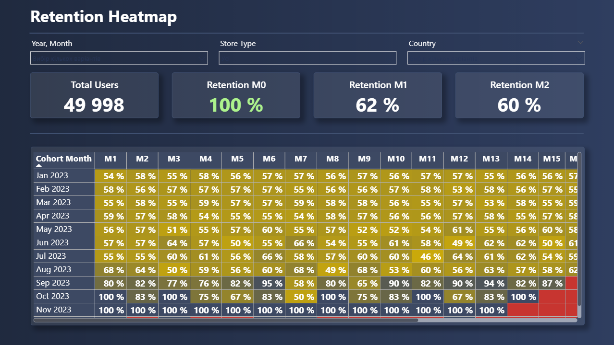
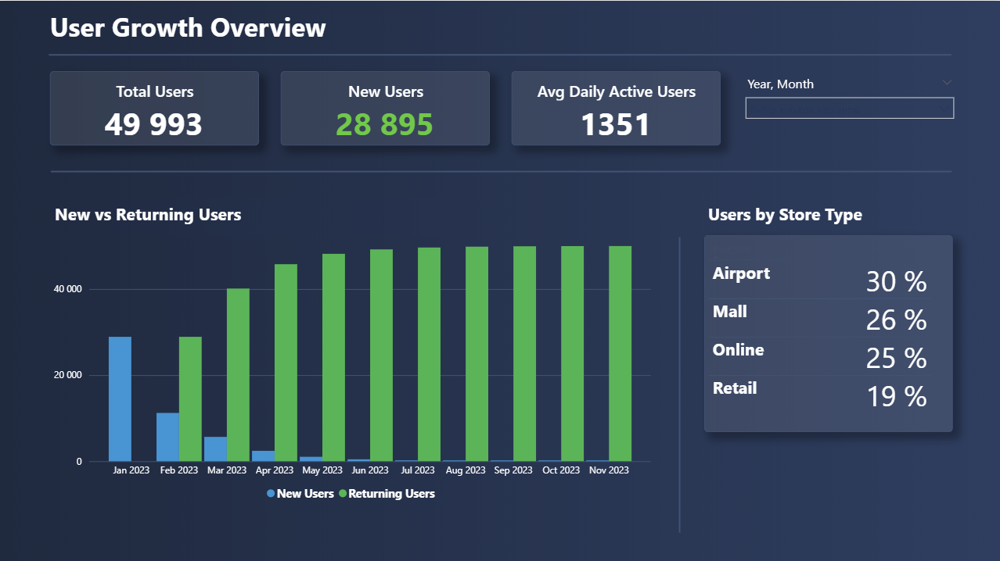
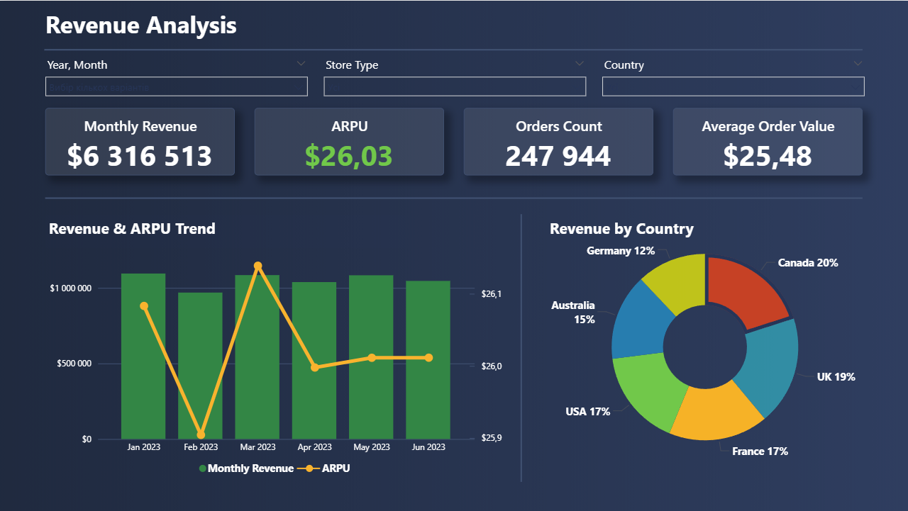
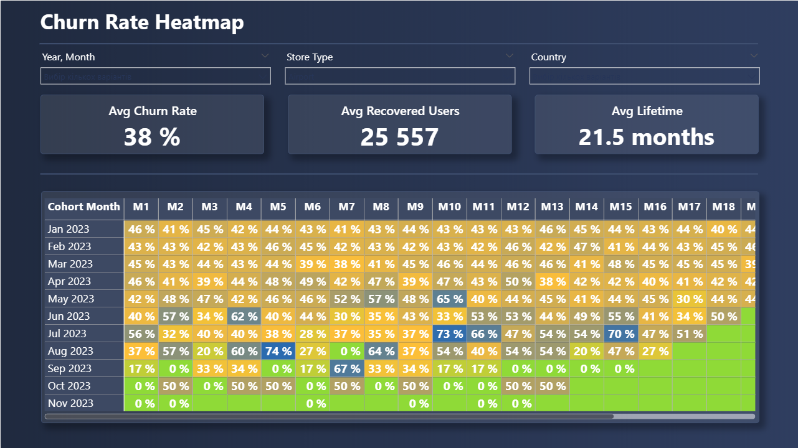
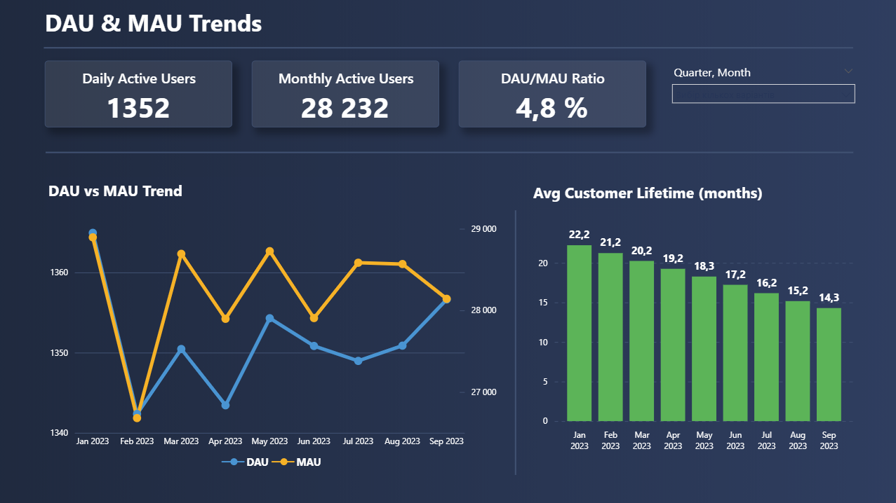

# Cohort & Retention Analysis | SQL + Power BI

End-to-end analytics project: data preparation in PostgreSQL and dashboard visualization in Power BI.  
Built as a portfolio project to demonstrate SQL pipeline design, data modeling, and business analytics skills.

> **Note on data:** This project uses a synthetic dataset generated to simulate retail transactions. As a result, some metrics appear unusually uniform (e.g. retention rates around 50% across all cohorts, atypically high recovered users count). In a real-world dataset these patterns would vary significantly. The focus of this project is on the analytical pipeline and visualization methodology, not on the data itself.

---

## Project Overview

The goal is to analyze customer behavior over time using cohort analysis — grouping customers by their first purchase month and tracking how they retain, churn, and generate revenue in subsequent months.

**Source data:** two tables — `sales_10k` (~1M rows) and `stores_10k`  
**Tools:** PostgreSQL · Power BI Desktop

---

## Business Questions Answered

- How well do we retain customers month over month?
- Which cohorts have the highest lifetime value?
- How does retention and churn differ by country and store type?
- How are DAU, MAU, and average customer lifetime trending over time?
- What share of revenue comes from new vs returning customers?
- Who are the recovered users (churned and returned)?

---

## Dashboard Pages

**1. User Growth Overview**  
Cards: Total Users, New Users, Avg Daily Active Users  
Clustered bar chart: New vs Returning Users by month  
Small table: Users by Store Type (%)

**2. Retention Heatmap**  
Cards: Total Users, Retention M0 / M1 / M2  
Matrix: Cohort Month × Month Label → retention rate with conditional formatting

**3. Revenue Analysis**  
Cards: Monthly Revenue, ARPU, Orders Count, Average Order Value  
Line + bar chart: Monthly Revenue & ARPU Trend  
Donut chart: Revenue by Country

**4. Churn Rate Heatmap**  
Cards: Avg Churn Rate, Avg Recovered Users, Avg Lifetime  
Matrix: Cohort Month × Month Label → churn rate with conditional formatting

**5. DAU & MAU Trends**  
Cards: Daily Active Users, Monthly Active Users, DAU/MAU Ratio  
Line chart: DAU vs MAU Trend  
Bar chart: Avg Customer Lifetime by cohort month

---

## SQL Pipeline

Structured as a sequence of temp tables — each step builds on the previous one. This keeps logic modular, readable, and easy to debug.

```
sales_10k + stores_10k
        │
        ▼
  clean_sales_temp        — removes nulls and zero-revenue rows
        │
        ▼
  first_orders_temp       — first order per customer defines cohort, country, store_type
        │
        ▼
  lifetime_temp           — all orders enriched with cohort attributes + month_number
        │
      ┌─┴──────────────┐
      ▼                ▼
cohort_size_temp   revenue_temp
      │                │
      └──────┬─────────┘
             ▼
      retention_temp      — retention rate per cohort × month_number
             │
             ▼
      metrics_temp        — cohort_size, retention_rate, revenue, arpu, churn_rate
             │
      ┌──────┴─────────────────────┐
      ▼                            ▼
lifetime_span_temp           recovered_temp
(avg lifetime per customer)  (gap > 1 month between purchases)
```

**Final datasets exported to CSV for Power BI:**

| File | Description |
|---|---|
| `cohort_metrics.csv` | Core cohort table: cohort × month_number × all metrics |
| `customer_metrics.csv` | One row per customer: total orders, revenue, lifetime |
| `dau.csv` | Daily active users |
| `mau.csv` | Monthly active users |
| `recovered_users.csv` | Monthly recovered users by country and store type |
| `aov.csv` | Monthly revenue, orders count, AOV, active customers by segment |

---

## Metrics Defined

| Metric | Definition |
|---|---|
| `cohort_month` | Month of a customer's first purchase |
| `month_number` | Months elapsed since cohort_month (0 = acquisition month) |
| `cohort_size` | Number of unique customers in the cohort |
| `retention_rate` | Share of cohort active in month N |
| `churn_rate` | 1 − retention_rate |
| `revenue` | Total revenue generated by the cohort in month N |
| `arpu` | Revenue / cohort_size for a given cohort × month |
| `avg_lifetime_months` | Months between first and last order per customer |
| `aov` | Average Order Value = total revenue / number of orders |
| `recovered_users` | Customers who returned after skipping ≥ 1 month |
| `dau` | Daily Active Users — unique customers with a purchase on a given day |
| `mau` | Monthly Active Users — unique customers with a purchase in a given month |

---

## Key SQL Concepts Used

- Window functions: `ROW_NUMBER()`, `LAG()`
- CTEs and temp tables for pipeline modularity
- Cohort date arithmetic with `DATE_PART()` and `DATE_TRUNC()`
- Conditional aggregation with `CASE WHEN` for pivot tables
- Multi-level joins across aggregated datasets
- Performance indexes on high-cardinality join keys

## Key Power BI / DAX Concepts Used

- Data modeling with Calendar table and cross-table relationships
- `TREATAS()` for virtual relationships between tables with different granularity
- `CALCULATE()` with multiple filter contexts
- Measures vs columns — all KPIs implemented as explicit DAX measures
- Organized measure table `_Measures` with display folders by category

---

## Repository Structure

```
├── README.md
├── sql/
│   └── cohort_pipeline_v2.sql
└── screenshots/
    ├── retention_heatmap.png
    ├── user_growth.png
    ├── revenue_analysis.png
    ├── churn_heatmap.png
    └── dau_mau_trends.png
```

> **Source data files** (`sales_10k.csv`, `stores_10k.csv`) are not included due to file size.  
> **Power BI report** (`cohort_analysis.pbix`) is not included due to file size.  
> Dashboard screenshots are available in the `screenshots/` folder.

---

## Dashboard Preview

### Retention Heatmap


### User Growth Overview


### Revenue Analysis


### Churn Rate Heatmap


### DAU & MAU Trends


---

## Project Conclusions & Insights

> These insights are based on a synthetic dataset and reflect simulated patterns rather than real business performance.

**Retention** stays around 50–60% across all cohorts and month numbers — unusually stable for retail. In real data, retention typically drops sharply after M1 (often to 20–30%) and continues declining. This uniformity is a characteristic of the synthetic data generator.

**Customer Lifetime** averages 14–22 months depending on cohort, with newer cohorts showing lower values simply because they have had less time to accumulate purchase history. This is expected and correct behavior.

**Revenue** is evenly distributed across countries (Canada 20%, UK 19%, France/USA 17%, Australia 15%, Germany 12%) — again reflecting synthetic generation rather than realistic market distribution.

**Store Type distribution** is relatively even: Airport 30%, Mall 26%, Online 25%, Retail 19%. In real retail, online channels typically show higher and faster growth.

**What would be different with real data:**
- Retention would drop sharply after M0 and stabilize at a lower level
- Cohort sizes would vary — seasonal effects, marketing campaigns, growth periods
- Revenue and AOV would show seasonality (peaks in Q4, dips in Q1)
- Recovered users would be a small fraction of MAU, not 30–40%

**Recommendations for next steps:**
- Replace synthetic data with a real public dataset (e.g. Olist Brazilian E-Commerce or Online Retail II from UCI) to get meaningful business insights
- Add RFM segmentation (Recency, Frequency, Monetary) to `customer_metrics` for richer customer profiling
- Add RFM segmentation (Recency, Frequency, Monetary) to `customer_metrics` — all required fields (last order date, total orders, total revenue) are already available in the pipeline
- Add revenue forecasting: Power BI's built-in Forecast line (Analytics pane on a Line chart) provides a quick 3–6 month projection using exponential smoothing — no code required. For more accurate forecasting with seasonality, a Python visual using `prophet` or `statsmodels` can be embedded directly in the report, though it requires Python to be installed on the viewer's machine

---

## 📌 Author

**Yuliia Nadtocha**  
[LinkedIn](https://www.linkedin.com/in/yuliia-nadtocha)
